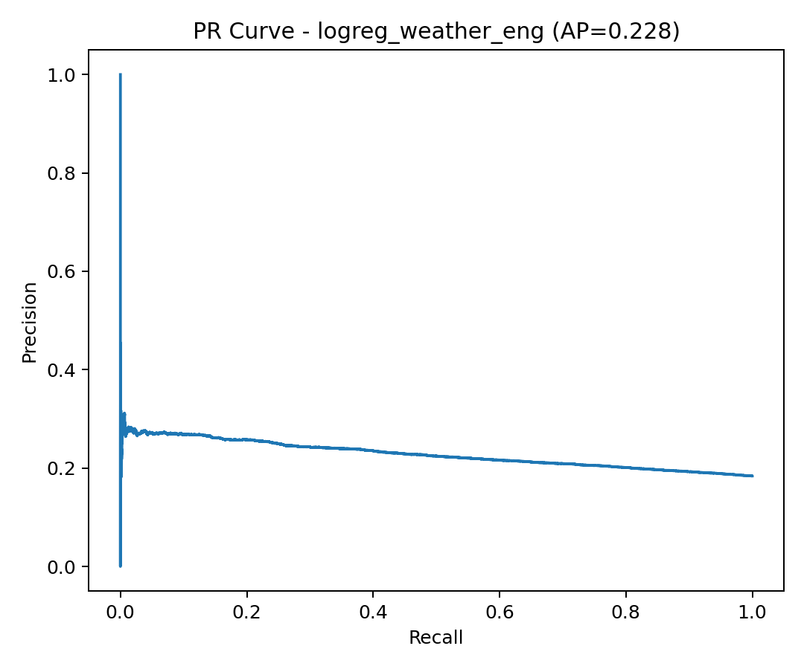
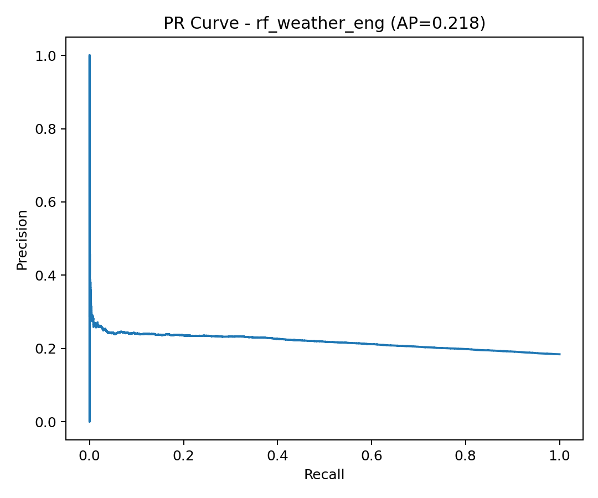
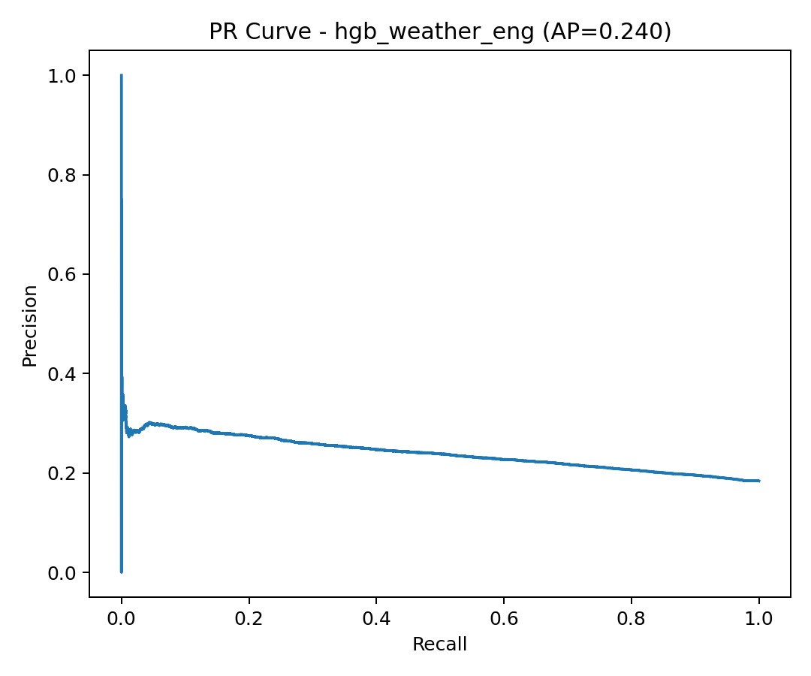

## 🎥 Final Presentation Video
[▶️ Watch on YouTube](https://youtu.be/1R5EThN75lM)

---

## ✈️ Flight Delay Prediction using US DOT & Weather Data

**Boston University – CS506: Data Science Tools & Applications**

---

### 📘 Project Overview

This project predicts **flight delays** by combining **US DOT On-Time Performance** data with **daily origin & destination weather** and several **engineered operational features**.

We study how airline, route, congestion, calendar effects, and coarse-grained weather jointly affect the probability that a flight arrives **15+ minutes late**.
The goal is not to perfectly predict every delay (which is extremely hard with public data), but to build a **clean, reproducible modeling pipeline** and quantify **how much signal** we can extract from these factors.

---


## 🔧 How to Build & Run the Project

### Requirements

- Python 3.9+  
- `make` (standard on macOS / Linux; on Windows you can use WSL, MSYS2, or install GNU Make)

Project structure (root):

```text
CS506/
  data/
    flights_cleaned.csv          # full cleaned flight data (from Google Drive)
    flights_sample_1pct.csv      # small sample for quick tests
    weather_daily.csv            # daily weather per airport (from Google Drive)
  outputs/
  src/
    data_cleaning.py
    eda_visualization.py
    model_training.py
    model_training_weather.py
    model_training_time_split.py
    per_group_metrics.py
    weather_download.py
    weather_merge.py
  makefile
  requirements.txt
  README.md
````

### Quick start (recommended)

From the repo root:

```bash
# 1. Create virtual environment, install dependencies, and run full pipeline
make run
```

What this does:

1. Creates a virtual environment `cs506_venv/`
2. Installs Python dependencies from `requirements.txt`
3. Runs, in order:

```bash
src/data_cleaning.py              # clean raw flights data
src/weather_download.py           # download daily weather from Meteostat
src/weather_merge.py              # merge flights + origin/destination weather
src/model_training.py             # train baseline (operational-only) models
src/model_training_weather.py     # train weather + engineered models
src/model_training_time_split.py  # train time-split models
src/per_group_metrics.py          # compute per-airline / per-airport metrics
```

Outputs are written under `outputs/`, including:

```text
outputs/plots/    # EDA plots, ROC/PR curves, confusion matrices, feature importance
outputs/models/   # serialized models and scalers
outputs/metrics/  # CSV files with per-group metrics
```

### Useful make targets

You can also run individual stages:

```bash
make data           # run data_cleaning.py only
make weather        # download & merge weather
make train-baseline # train baseline models
make train-weather  # train weather + engineered models
make time-split     # temporal train/test split experiments
make per-group      # per-airline / per-origin metrics
make eda            # regenerate EDA plots
make clean          # remove cs506_venv virtual environment
```

> 📥 **Full data**
> To fully reproduce the experiments, download `flights_cleaned.csv` and `weather_daily.csv`
> from the Google Drive folder linked below and place them in the `data/` directory.

---

## 🧩 Dataset

| Source                             | Description                                                                                                                         | Link                                                                                                           |
| ---------------------------------- | ----------------------------------------------------------------------------------------------------------------------------------- | -------------------------------------------------------------------------------------------------------------- |
| **BTS On-Time Performance (2020)** | Flight-level data including scheduled/actual departure & arrival times, airlines, and airports.                                     | [US DOT BTS Dataset](https://www.transtats.bts.gov/OT_Delay/OT_DelayCause1.asp)                                |
| **Meteostat (Daily Weather)**      | Daily weather (temperature, precipitation, wind, pressure, etc.) at major US airports.                                              | [Meteostat API](https://dev.meteostat.net/python/)                                                             |
| **Processed Dataset (merged)**     | Cleaned flights + **origin & destination daily weather** + engineered features (route stats, congestion proxies, target encodings). | [Google Drive Folder](https://drive.google.com/drive/folders/11Bs78yYzX7t18sY3JP_uk08K3PCpzmxg?usp=drive_link) |

> ⚠️ Because of GitHub’s 100 MB limit, the repo only includes a **1% sample** (`data/flights_sample_1pct.csv`) for testing.
> The **full cleaned & merged datasets** live in the Google Drive folder above.

---

## 📊 Exploratory Analysis & Intuition

### 1️⃣ Delay Rate by Month


* Delay rates show **strong seasonality**.
* Peaks around **June–July** and again in **December**, consistent with summer storms and holiday traffic.

---

### 2️⃣ Delay Rate by Day of Week


* **Fridays and Sundays** have the highest delay rates, aligning with commuting + weekend leisure travel.
* **Tuesdays/Wednesdays** are the least delayed days.

---

### 3️⃣ Delay Rate for Top Origin Airports


* Large hubs such as **ATL, DFW, ORD, DEN** have delay rates above 20%.
* Smaller or less congested airports show lower delay rates.

---

### 4️⃣ Departure vs. Arrival Delay


* Strong linear relationship: late departures almost always translate into late arrivals.
* Pearson correlation ≈ **0.93**, confirming heavy delay propagation along the route network.

---

## 🧮 Modeling Setups

We build two main modeling pipelines:

1. **Baseline (Operational Only)** – pre-flight features only

   * Airline (`IATA_Code_Operating_Airline`)
   * Origin, Destination
   * Month, DayOfWeek (+ optional `DepHour` when available)
   * **Engineered**:

     * `is_weekend`
     * `route_freq` (historical frequency of the origin–destination pair)

2. **Weather + Engineered Pipeline** – baseline + richer structure

   * All baseline features above
   * **Origin & Destination daily weather** from Meteostat:
     `tavg, tmin, tmax, prcp, snow, wspd, wdir, wpgt, pres, tsun`
     plus `dest_*` counterparts from the destination airport merge
   * **Engineered congestion & target encodings**:

     * `origin_day_volume` – # flights per (Origin, FlightDate), proxy for local congestion
     * `te_origin_month` – target encoding of (Origin, Month) → historical delay rate
     * `te_route` – target encoding of (Origin, Dest) → historical route delay rate

### Data Processing & Encoding

* **Cleaning & merging**

  * `data_cleaning.py` generates `outputs/flights_preprocessed.parquet` with clean delay labels.
  * `weather_download.py` downloads daily airport weather (2020).
  * `weather_merge.py` merges **origin & destination** weather into flights, producing
    `outputs/flights_with_weather_sample.parquet` and (optionally) partitioned full data.

* **Categorical encoding**

  * Airlines, Origin, Dest are converted to pandas `category` and stored as integer codes.

* **Imputation & scaling**

  * For weather and engineered numeric features we use **median imputation fit on the train split only** (via `SimpleImputer`).
  * Logistic Regression uses **StandardScaler** on the imputed feature matrix; tree models consume the raw imputed values.

* **Train / test split**

  * Main experiments use an 80/20 **stratified random split** on the 1% sample.
  * Additional scripts (`model_training_time_split.py`, `per_group_metrics.py`) explore:

    * **Temporal generalization** (train on early 2020 → test on later months).
    * **Per-group metrics** (e.g., per-origin / per-airline performance at a fixed threshold).

---

## 🤖 Models & Evaluation

### Models

1. **Logistic Regression (balanced)**
2. **Random Forest (balanced class weights)**
3. **HistGradientBoosting (HGB)** for tabular data

All models predict the binary label **Delayed (arrival delay ≥ 15 min)**.

### Metrics

* **Accuracy**
* **Precision / Recall / F1**
* **ROC-AUC**
* **Average Precision (AP)** on the **Precision–Recall curve** (important under class imbalance).

---

## 📉 Baseline Performance (Operational-Only)

### ROC – Baseline Models


* With operational features only, models achieve **AUC ≈ 0.52–0.54**.
* They are **barely better than random** for this highly noisy task.

### Random Forest Feature Importance – Baseline


* Most important baseline signals:

  * `route_freq` – some routes have systematically higher/lower delay rates.
  * `Dest` and `Origin` – airport identity captures congestion and local processes.
  * `Month` and `DayOfWeek` – seasonality and weekday patterns.
  * `IATA_Code_Operating_Airline` – carrier-specific operations.

---

## 🌦️ Weather + Engineered Models

### ROC Curves – Weather + Engineered


* Adding weather + engineered features increases AUC to around **0.58–0.59**:

  * LogReg: AUC ≈ **0.577**
  * RF: AUC ≈ **0.564**
  * HGB: AUC ≈ **0.594**

Although still modest, this confirms that **weather and congestion structure add real predictive signal** on top of baseline features.

### Precision–Recall Curves (Weather + Engineered)





* Average Precision (AP) scores:

  * LogReg: **0.228**
  * RF: **0.218**
  * HGB: **0.240**
* PR curves drop quickly: even our best model has **precision ≈ 0.25 when recall ≈ 0.3–0.4**.
* This reflects the difficulty of delay prediction: many “unexpected” delays are not explainable from coarse flight + daily weather variables alone.

### Confusion Matrices (Default 0.5 Threshold)

Baseline vs. weather-enhanced Logistic Regression:

* **LogReg (baseline)** – random split

  * `TN=36,956`, `FP=35,879`, `FN=7,792`, `TP=8,632`
* **LogReg (weather + engineered)**

  * `TN=44,222`, `FP=28,613`, `FN=8,167`, `TP=8,257`

HistGradientBoosting (weather + engineered):

* `TN=72,518`, `FP=317`, `FN=16,294`, `TP=130`

Interpretation:

* **LogReg weather+eng** trades a bit of accuracy for a more balanced precision/recall.
* **HGB** with threshold 0.5 has high accuracy (it almost always predicts “no delay”) but essentially **misses most delayed flights** – good ROC-AUC but poor recall at that operating point.

(Plots: `cm_logreg_baseline.png`, `cm_rf_baseline.png`, `cm_logreg_weather.png`, `cm_rf_weather.png`, `cm_hgb_weather.png`.)

### Feature Importance – Weather + Engineered


* Once we add weather and congestion features, the **top predictors** become:

  * `te_route` – historical delay rate of the route.
  * `origin_day_volume` – flights per origin + date (congestion proxy).
  * `route_freq` – pure traffic volume on the route.
  * `Dest`, `Origin`, `DayOfWeek`, `te_origin_month`.
* Weather variables (`tavg`, `wspd`, `pres`, plus `dest_*`) show **non-zero but secondary importance**.

  * Weather helps, but structural/operational signals (route history + congestion) dominate.

---

## 📈 Quantitative Summary

Using the confusion matrices and ROC/PR curves, the main random-split results on the 1% sample are:

| Model                | Features               |  Accuracy | Precision | Recall |   F1  |    AUC    |     AP    |
| :------------------- | :--------------------- | :-------: | :-------: | :----: | :---: | :-------: | :-------: |
| Logistic Regression  | Operational only       |   0.511   |   0.194   |  0.526 | 0.283 |   0.523   |     –     |
| Random Forest        | Operational only       |   0.754   |   0.214   |  0.134 | 0.165 |   0.544   |     –     |
| Logistic Regression  | + Weather + Engineered |   0.591   |   0.224   |  0.503 | 0.309 |   0.577   |   0.228   |
| Random Forest        | + Weather + Engineered |   0.814   |   0.242   |  0.082 | 0.121 |   0.564   |   0.218   |
| HistGradientBoosting | + Weather + Engineered | **0.814** | **0.291** |  0.008 | 0.015 | **0.594** | **0.240** |

Key takeaways:

* **ROC-AUC improves** from ~0.53 (baseline) to ~0.59 with weather + engineered features.
* **Logistic Regression** offers the best trade-off between accuracy and recall when using a fixed 0.5 threshold.
* **HGB** has the best AUC/AP but requires **careful threshold calibration**; at 0.5 it essentially never predicts delays.
* RF and HGB become especially useful when we **adjust the decision threshold** (via the PR-based sweep) for use cases that prefer high recall or high precision.

---

## ⚠️ Challenges & Limitations

1. **Low Predictive Ceiling**

   * Even the best model reaches only **AUC ≈ 0.59** and **AP ≈ 0.24**.
   * Many real-world delay drivers (air traffic control restrictions, crew constraints, maintenance, connecting passengers, etc.) are simply **not present** in public data.

2. **Class Imbalance**

   * Only ~18% of flights are delayed, so a trivial “always on-time” classifier already looks good on accuracy.
   * We mitigate this via **class_weight="balanced"**, ROC/PR analysis, and threshold sweeps, but recall for the minority class remains challenging.

3. **Coarse Weather Resolution**

   * We use **daily** weather aggregates by airport; real operations depend on **hourly** or even finer-grained conditions (storms, microbursts, runway visibility).

4. **Temporal & Network Effects**

   * Delays propagate through aircraft rotations and hub waves.
   * Our current models treat each flight independently and do not model flight-to-flight dependencies or aircraft/crew turn-around chains.

5. **Heterogeneity Across Airlines & Airports**

   * Per-group analysis shows that some airlines and hubs are easier to model than others.
   * A single global model may underperform compared to **specialized models per region/airline**.

---

## 🧠 Possible Next Steps

Some directions we did **not** fully pursue (but would be natural extensions):

* Pull **hourly weather** (or METAR data) to better capture storms and local extremes.
* Explicitly model **delay propagation** using lag features (previous flight delay on the same tail number / route) or sequence models.
* Train **airport- or airline-specific models**, or at least use per-group calibrated thresholds from the `per_group_metrics.py` analysis.
* Explore **gradient boosting libraries** like XGBoost/LightGBM on the full dataset.
* Build a small **Streamlit / Flask demo** to let users input a flight and see predicted delay probability + key drivers.

---

## 📤 Data Access

You can download the **full datasets** from Google Drive:
📂 [CS506 Project Data (Google Drive)](https://drive.google.com/drive/folders/11Bs78yYzX7t18sY3JP_uk08K3PCpzmxg?usp=drive_link)

Contents:

* `flights_cleaned.csv` (~3.8 GB)
* `weather_daily.csv` (~185 KB)
* `flights_with_weather_sample.parquet`
* (Optional) partitioned merged parquet files under `outputs/flights_with_weather/`

