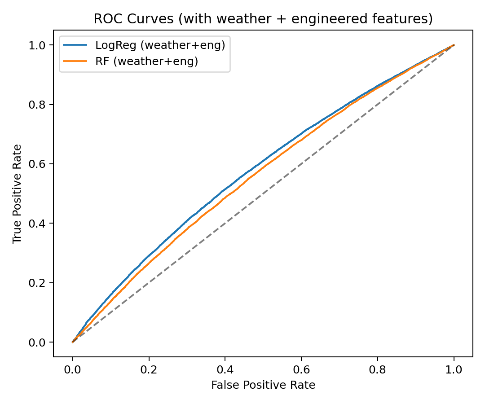
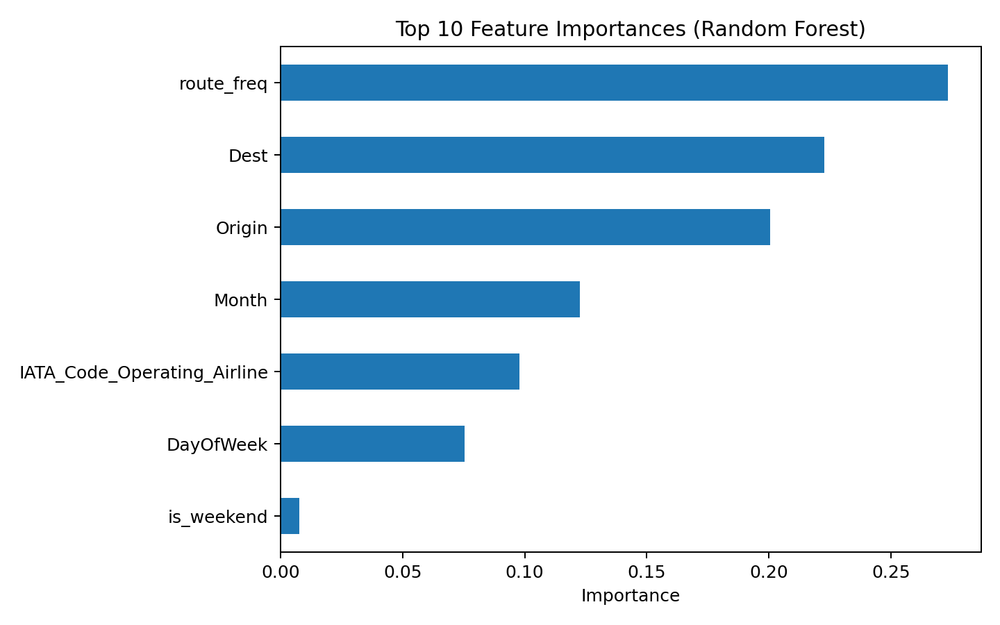

## 🎥 Midterm Presentation Video
[▶️ Watch on YouTube](https://youtu.be/1houPocJZIM)

---

## ✈️ Flight Delay Prediction using US DOT & Weather Data  
**Boston University – CS506: Data Science Tools & Applications**  

---

### 📘 Project Overview
This project predicts **flight delays** using data from the **US Department of Transportation (Bureau of Transportation Statistics)** combined with **daily weather data** from **Meteostat**.

We aim to explore how operational (e.g., airlines, weekdays, routes) and environmental (e.g., temperature, precipitation, pressure) factors influence the likelihood of flight delays.  
The goal is to develop a robust, reproducible model that can estimate the probability of a flight delay based on both **flight-level** and **weather** features.

---

## 🧩 Dataset

| Source | Description | Link |
|--------|--------------|------|
| **BTS On-Time Performance (2020)** | Flight-level data including scheduled and actual departure/arrival times, airlines, and airports. | [US DOT BTS Dataset](https://www.transtats.bts.gov/OT_Delay/OT_DelayCause1.asp) |
| **Meteostat (Daily Weather)** | Daily temperature, wind speed, and pressure data per airport. | [Meteostat API](https://dev.meteostat.net/python/) |
| **Processed Dataset (merged)** | Cleaned and merged flight + weather + engineered features. | [Google Drive Folder](https://drive.google.com/drive/folders/11Bs78yYzX7t18sY3JP_uk08K3PCpzmxg?usp=drive_link) |

> ⚠️ Due to GitHub’s 100 MB file limit, only a **1% sample dataset** (`flights_sample_1pct.csv`) is stored in this repo for testing.  
> The **full datasets** are hosted on Google Drive.

---

## 📊 Preliminary Visualizations and Analysis

### 1️⃣ Delay Rate by Month

- Shows seasonal variation in flight delays throughout 2020.  
- Delay rates tend to **increase during summer months (June–August)** due to higher air traffic volume and weather disruptions.  
- A smaller spike appears in **December**, aligning with holiday travel peaks.  

---

### 2️⃣ Delay Rate by Day of Week

- Delay rates vary across weekdays.  
- **Fridays and Sundays** show higher delay frequencies, which makes sense since they correspond to business return trips and weekend leisure traffic.  
- **Tuesdays and Wednesdays** show the fewest delays.  

---

### 3️⃣ Delay Rate by Airport

- This visualization highlights **top airports with the highest delay rates**.  
- Major hub airports such as **ATL, ORD, and JFK** show more delays due to traffic congestion and operational complexity.  
- Smaller airports generally exhibit fewer delays.  

---

### 4️⃣ Departure vs Arrival Delay Correlation

- Displays a **strong linear correlation** between departure and arrival delays.  
- Late departures often cascade into late arrivals, suggesting systemic schedule propagation issues.  
- Correlation coefficient (Pearson) ≈ **0.93**, confirming the dependency.  

---

### 5️⃣ ROC Curves – Baseline Models

- ROC curves compare initial models trained without weather data.  
- Logistic Regression and Random Forest achieve moderate AUC (~0.55).  
- This baseline provides a reference for performance improvement once weather and feature engineering are added.  

---

### 6️⃣ ROC Curves – Weather-Enhanced Models

- Models trained with weather variables show an **improvement in AUC from ~0.55 → 0.58**.  
- Weather variables such as `temperature`, `wind speed`, and `pressure` contribute to better classification of delayed flights.  

---

### 7️⃣ ROC Curves – All Combined Models

- Combines baseline, weather-only, and feature-engineered models.  
- **Histogram-based Gradient Boosting (HGB)** achieves the best AUC (~0.59).  
- Indicates that while delay prediction remains a difficult problem, added context improves performance modestly.  

---

### 8️⃣ Feature Importance (Random Forest – Base Model)

- The most predictive features in the base model include:  
  - **Route frequency** (flights per route)  
  - **Scheduled departure time** (temporal pattern)  
  - **Day of week**  
- Weather variables were not yet included here.  

---

### 9️⃣ Feature Importance (Random Forest – With Weather)

- After integrating weather data, the top predictors include:  
  - **Route frequency**
  - **Origin-day flight volume**
  - **Temperature**
  - **Wind speed**
  - **Pressure**  
- Weather features rank just below operational ones, confirming their incremental predictive power.

---

## ⚙️ Data Processing Pipeline

1. **Data Cleaning**
   - Removed flights with missing or invalid delay data.  
   - Dropped irrelevant columns (e.g., tail numbers, cancellation codes).  
   - Standardized column names and converted time fields to datetime format.  

2. **Weather Data Integration**
   - Downloaded daily weather observations from the **Meteostat API** for each airport.  
   - Merged weather features by airport and date.  
   - Missing values were imputed using median interpolation.  

3. **Feature Engineering**
   - `route_freq`: Number of flights per (origin, destination).  
   - `origin_day_volume`: Number of flights per origin airport per day.  
   - `is_weekend`: Boolean flag for weekend flights.  
   - `temp_mean`, `wind_mean`, and `pressure_mean`: from merged weather.  

4. **Normalization & Encoding**
   - Scaled numerical features using **StandardScaler**.  
   - Encoded categorical features (e.g., airlines, airports) using **OneHotEncoder**.  

---

## 🤖 Modeling Methods

### Models Implemented
1. **Logistic Regression (Baseline)**
   - Interpretable linear model for binary classification.
2. **Random Forest (Ensemble)**
   - Nonlinear model capturing feature interactions.
3. **HistGradientBoosting (HGB)**
   - Gradient-boosted trees optimized for tabular data.

### Evaluation Metrics
- **Accuracy**
- **Precision**
- **Recall**
- **F1-Score**
- **ROC-AUC**

### Validation
- Train-test split (80/20).  
- Stratified sampling to balance delay vs. non-delay classes.  
- ROC and Precision-Recall curves used for diagnostic visualization.

---

## 📈 Preliminary Results

| Model                  | Features                  | Accuracy | Precision | Recall | F1-score |  AUC  |
|:-----------------------|:--------------------------|:--------:|:---------:|:------:|:-------:|:-----:|
| Logistic Regression    | Operational only          |  0.784   |   0.237   | 0.082  |  0.122  | 0.560 |
| Random Forest          | Operational only          |  0.784   |   0.237   | 0.082  |  0.122  | 0.560 |
| Logistic Regression    | + Weather + Engineered    |  0.588   |   0.225   | **0.509** | 0.312 | 0.577 |
| Random Forest          | + Weather + Engineered    |  0.784   |   0.237   | 0.082  |  0.122  | 0.560 |
| HistGradientBoosting   | + Weather + Engineered    | **0.814** |  0.257   | 0.010  |  0.019  | **0.591** |

**Interpretation:**
- Weather and engineered features improve recall significantly for Logistic Regression.  
- Histogram Gradient Boosting achieves the best AUC (0.59).  
- Route-level and weather-based predictors jointly improve overall detection sensitivity.  

---

## ⚠️ Current Challenges and Limitations

Although the current pipeline successfully integrates flight and weather data and produces consistent results across models, several issues remain:

1. **Low AUC / Model Performance Ceiling**  
   - Even with additional weather and engineered features, the AUC only reaches about **0.59**.  
   - This indicates the models capture some but not all underlying delay factors — suggesting that other variables (like air traffic control, carrier policies, or airport-level congestion) may be missing.

2. **Imbalanced Classes**  
   - Only around **18% of flights are delayed**, leading to bias toward the majority (non-delayed) class.  
   - Models tend to have high accuracy but low recall for delays.

3. **Temporal Dependency**  
   - Flight delays often depend on time sequences (e.g., previous flight delays causing propagation).  
   - Current models treat all rows independently, ignoring sequential or temporal correlations.

4. **Weather Feature Granularity**  
   - Daily-aggregated weather data may not fully represent real-time conditions at departure/arrival hours.  
   - Hourly weather data could potentially improve sensitivity.

5. **Operational Heterogeneity**  
   - Airlines and airports behave differently; model performance varies by region and carrier.  
   - Further stratified or per-airport modeling could improve robustness.

These challenges explain why the results, while consistent, still have limited predictive power (AUC < 0.6) and motivate further experimentation.

---

## 🧠 Next Steps
- Add **temporal validation** (train early months → test later months).  
- Investigate **class imbalance** using SMOTE or reweighting.  
- Explore **XGBoost / LightGBM** models for better recall.  
- Build a **Streamlit dashboard** for interactive predictions.  

---

## 📤 Data Access
You can download the **full datasets** from Google Drive:  
📂 [CS506 Project Data (Google Drive)](https://drive.google.com/drive/folders/11Bs78yYzX7t18sY3JP_uk08K3PCpzmxg?usp=drive_link)

Contents:
- `flights_cleaned.csv` (~3.8 GB)  
- `weather_daily.csv` (~185 KB)  
- `flights_with_weather_sample.parquet`  

---
